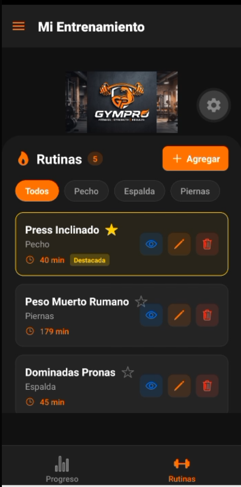
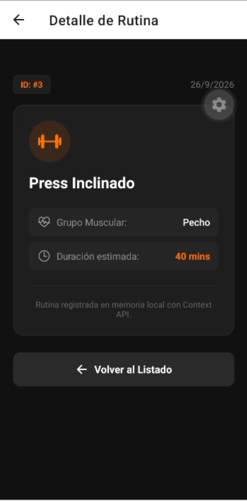
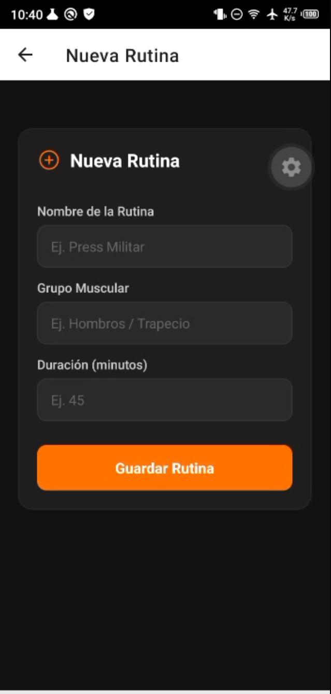
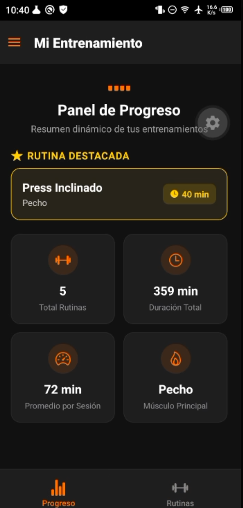

# GymPro - Gestión Avanzada de Rutinas Fitness y Persistencia Local

Aplicación móvil desarrollada con React Native, Expo y TypeScript.

Para la realización y evolución de este proyecto se perfeccionó la identidad visual de la marca deportiva **GymPro**, integrando una arquitectura de navegación anidada multinivel, gestión de estado global reactiva con Context API, persistencia en base de datos relacional local con SQLite, validaciones de negocio en formularios y un panel analítico en tiempo real.

Se utilizaron 3 niveles de navegación estructurada:

🗂️ Drawer Navigation (Sidepanel): Configurado como el menú principal de la app para el Nivel 1, permitiendo desplegar el panel lateral izquierdo con las secciones de "Mi Entrenamiento" y "Configuración".

📱 Tab Button Navigation: Gestiona la navegación interna para el Nivel 2 mediante una barra inferior fija, permitiendo alternar al instante entre las pantallas de "Rutinas" y "Progreso".

🥞 Stack Navigation: Diseñado para el Nivel 3 con navegación profunda, permitiendo apilar pantallas sobre el Drawer y las Tabs al consultar el "Detalle de Rutina" o al acceder al formulario de "Agregar / Editar Rutina" con retorno nativo.

---

## 🏋️‍♂️ Descripción del Proyecto

La aplicación implementa una arquitectura desacoplada que combina navegación multinivel con persistencia local robusta:

* **Menú Lateral (DrawerNavigator - Nivel 1):** Acceso global con iconos vectoriales a las secciones principales:
  * **Mi Entrenamiento:** Carga e integra directamente el contenedor de pestañas inferiores.
  * **Configuración:** Vista independiente para ajustes generales y preferencias.
* **Pestañas Inferiores (TabNavigator - Nivel 2):** Navegación persistente entre módulos de entrenamiento:
  * **Rutinas (`RoutineListScreen`):** Listado dinámico con `FlatList` sincronizado con SQLite:
    * Cabecera compacta con imagotipo corporativo oficial GymPro y contador de rutinas.
    * Barra interactiva de filtros por grupo muscular (`Todos`, `Pecho`, `Espalda`, `Piernas`) mediante `useMemo`.
    * Tarjetas de rutinas con nombre, grupo muscular, duración estimada e indicador de rutina destacada.
    * Acciones rápidas por tarjeta: Marcar/Desmarcar Destacada (estrella), Ver Detalle (ojo), Editar (lápiz) y Eliminar (basurero con modal de confirmación).
  * **Progreso (`ProgressScreen`):** Dashboard analítico en tiempo real:
    * Tarjeta principal que muestra la **Rutina Destacada** seleccionada.
    * Indicadores dinámicos calculados: Total de rutinas, Duración total (minutos), Promedio por sesión y Músculo principal predominante.
* **Pila de Navegación Global (RootStackNavigator - Nivel 3):** Navegación profunda con pantallas modales apiladas:
  * **Detalle de Rutina (`RoutineDetailScreen`):** Vista apilable que presenta la ficha técnica completa del ejercicio, ID único, fecha de creación y botón de retorno.
  * **Formulario de Rutina (`AddRoutineScreen`):** Pantalla unificada para creación y edición asistida por validaciones de negocio.

---

## 🚀 Nuevas Funcionalidades y Reglas de Negocio

* **Persistencia Local con SQLite (`expo-sqlite`):**
  * Inicialización automática del esquema de la tabla `rutinas` mediante la propiedad `onInit` en `SQLiteProvider`.
  * Operaciones CRUD (`SELECT`, `INSERT`, `UPDATE`, `DELETE`) integradas con `RoutineContext` para garantizar disponibilidad offline y persistencia tras reiniciar la app.
* **Filtro Reactivo por Grupo Muscular:**
  * Filtrado dinámico en memoria sin duplicar listas independientes, recalculándose al vuelo con los datos provistos por el contexto.
* **Regla de Negocio - Única Rutina Destacada (`featured`):**
  * El sistema asegura que solo puede existir **una única rutina destacada a la vez**.
  * Al marcar una nueva rutina como destacada, la anterior pasa automáticamente a `false` tanto en el estado reactivo como en SQLite.
* **Validaciones Estrictas de Formulario:**
  * Validación de campos obligatorios (`nombre`, `grupo muscular`, `duración`) saneados con `.trim()`.
  * Validación numérica estricta que exige una duración en el rango de **10 a 180 minutos** tanto al crear como al editar, impidiendo el retorno si existen errores.

---

## 🕹️ Tecnologías Implementadas

* React Native
* Expo SDK
* TypeScript
* expo-sqlite (API asíncrona moderna con `SQLiteProvider`)
* Context API (Gestión de estado global y Hooks personalizados)
* @react-navigation/native
* @react-navigation/native-stack
* @react-navigation/drawer
* @react-navigation/bottom-tabs
* react-native-safe-area-context
* react-native-gesture-handler
* react-native-reanimated
* @expo/vector-icons (Ionicons)

---

## 🔧 Instalación y Uso

Para poder ejecutar el proyecto, sigue los siguientes pasos desde la terminal de tu editor:

1. Clona el repositorio desde la terminal:
   ```bash
   git clone [https://github.com/luisAristeguieta/GymPro.git](https://github.com/luisAristeguieta/GymPro.git)
   cd GymPro


2. Instala las dependencias en la terminal del editor:
```bash (se vea esto en todos los pasos ya que lo estoy haciendo en VSC)
npm install
```

3. Inicia el servidor Expo:
```bash
npx expo start --tunnel
```

4. Ejecuta en tu móvil con la app Expo Go:
Escanea el código QR resultante o abre el enlace generado desde la aplicación Expo Go en Android o iOS.

## 📱 Vista Previa de la Aplicación

| Listado Dinámico | Detalle de Rutina | Creación / Edición | Panel de Progreso |
| :---: | :---: | :---: | :---: |
|  |  |  |  |

---

### 📹 Videos Demostrativos y Entregables

* 🎬 **Video 1 (Explicación técnica del código):** [Ver Video 1](./Entregable/video1.mp4)
* 📱 **Video 2 (Demostración de la aplicación final):** [Ver Video 2](./Entregable/video2.mp4)